# SQL Challenge - Configuration and Report

This Report brings the details of the exercise detailed in [README.md](README.md).
  
## Creating the Database and Tables

### Creating the Database

First of all, a new Database needs to be created using pgAdmin. In this SQL Challenge homework, it was created a database named `Employee`.

Once the Database is created, it has to be configured to load properly the CSV files. This is to prevent issues when converting the **Date** format from the CSV file, which is using MDY format (US format). Therefore, the following instruction has to be performed in the newly Database:
```sql
ALTER  DATABASE  "Employee" SET  "DateStyle"  TO  'iso, mdy';
```
After that, a new session of the query to be open, and the following instruction to check if the Database is set to the correct configuration:
```sql
SHOW DATESTYLE;
```
which should return:
```sql
"ISO, MDY"
```


### Creating the Tables

The script to create the tables are detailed in **`sql-challenge_table-schema.sql`** script.

The tables to be created in the following order, as per the sql script file:

1. department
2. title
3. employee
4. salary
5. dept_emp
6. dept_manager
    
### Loading the data from CSV files

CSV files to be manually imported to pgAdmin in the following order:
* Step 1: Import data for the `department` table: "**departments.csv**"
* Step 2: Import data for the `title` table: "**titles.csv**"
* Step 3: Import data for the `employee` table: "**employees.csv**"
* Step 4: Import data for the `salary` table: "**salaries.csv**"
* Step 5: Import data for the `dept_emp` table: "**dept_emp.csv**"
* Step 6: Import data for the `dept_manager` table: "**dept_manager.csv**"


## Data Analysis & Queries
  
The following items have been analysed and SQL queries prepared into **`sql-challenge_queries.sql`** script file:

1. List the following details of each employee: employee number, last name, first name, sex, and salary.

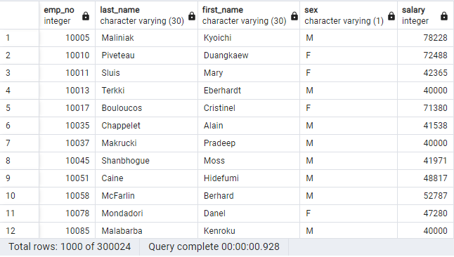

2. List first name, last name, and hire date for employees who were hired in 1986.

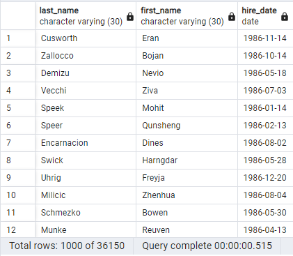

3. List the manager of each department with the following information: department number, department name, the manager's employee number, last name, first name.

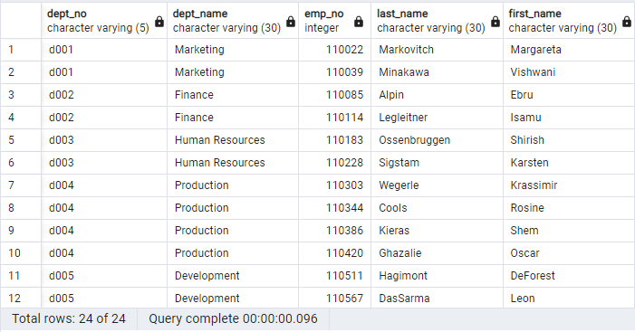

4. List the department of each employee with the following information: employee number, last name, first name, and department name.

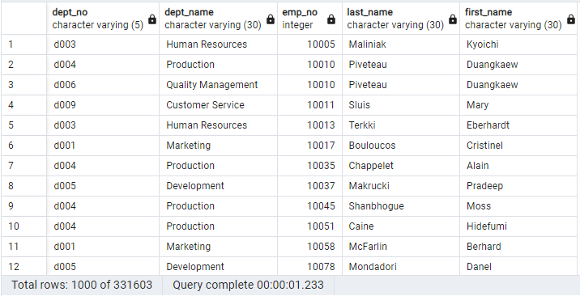

5. List first name, last name, and sex for employees whose first name is "Hercules" and last names begin with "B."

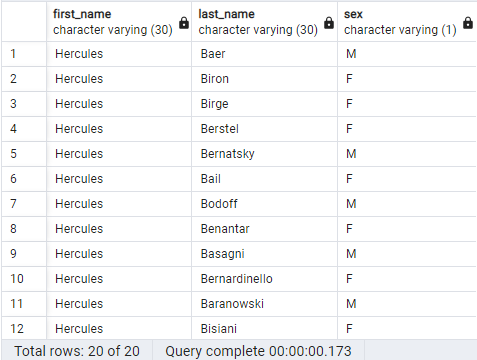

6. List all employees in the Sales department, including their employee number, last name, first name, and department name.

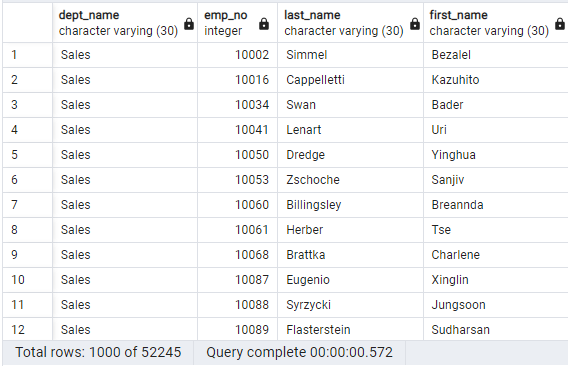

7. List all employees in the Sales and Development departments, including their employee number, last name, first name, and department name.

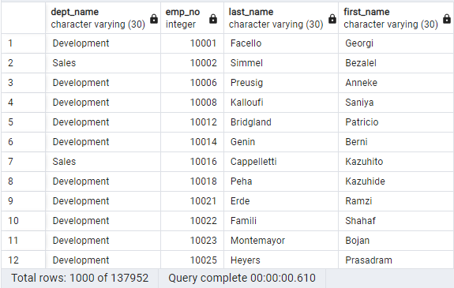

8. List the frequency count of employee last names (i.e., how many employees share each last name) in descending order.

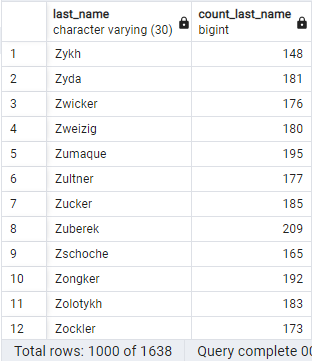


## Bonus
  
The following activities being done as bonus through importing the SQL database into Pandas and generating some plots:

1. Import the SQL database into Pandas.

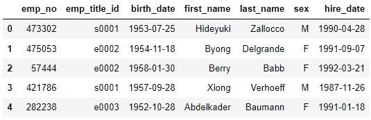

2. Create a histogram to visualize the most common salary ranges for employees.

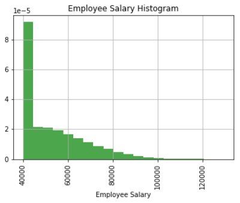

3. Create a bar chart of average salary by title.

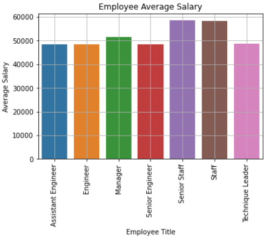